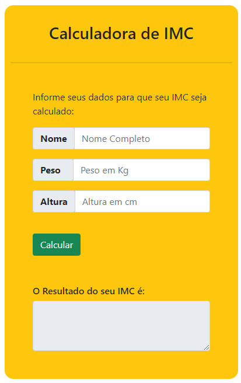

# IMC Calculator

This a simple IMC Calculator Done using JS, HTML and CSS. 

Usage Example
----------

Built With
----------

- HTML5
- CSS3
- Javascript
- Boostrap5

Versioning
----------

We use `GitHub <http://github.com/lhggomes/>`__ for versioning. For the
versions available

Authors
-------

-  **Lucas Henrique Silva Gomes** -

License
-------

This is free and unencumbered public domain software. For more
information, see http://unlicense.org/ or the accompanying
`UNLICENSE <UNLICENSE>`__ file.

